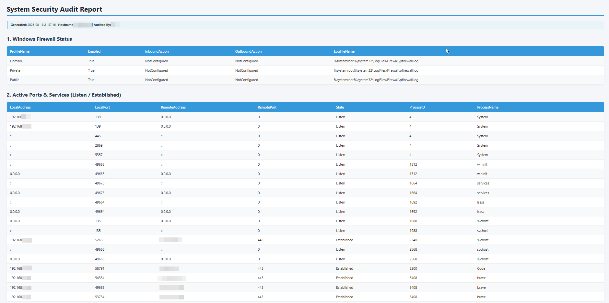

# Windows Security Auditing Tool (PowerShell)

---

## 🔍 Key Features

- **User & Account Policy Audit:** Checks password complexity requirements, lockout thresholds, and local administrator group members.
- **Privilege & Service Inspection:** Identifies unquoted service paths and services running with high privileges.
- **Firewall & Network Configuration:** Verifies Windows Firewall profile states and active listening ports.
- **Export Formats:** Generates structured output in both CLI and JSON formats for further SIEM / Pandas ingestion.

---

## 📋 Requirements

- Windows 10 / 11 / Windows Server
- PowerShell 5.1 or higher
- **Administrator privileges** (required to query security policies)

---

## 🚀 Usage

Clone the repository:
```powershell
git clone [https://github.com/twoj-profil/windows-security-audit.git](https://github.com/twoj-profil/windows-security-audit.git)
cd windows-security-audit
```

Run the audit script as Administrator:
```powershell
.\src\Audit-WindowsSecurity.ps1 -ExportJson
```

---

## 📊 Sample Output

```

---

## ⚠️ Disclaimer

This tool is intended for authorized security assessments and system administrative audits only.
